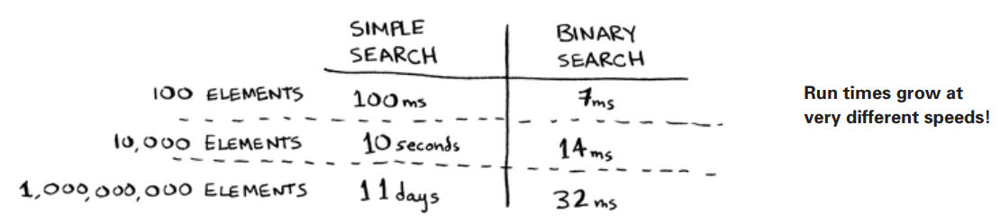
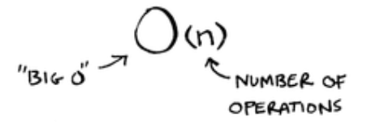
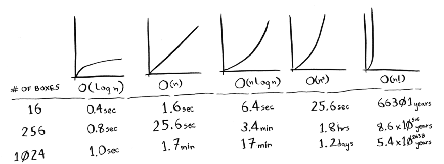

# Big O notation

<b> Big O notation is special notation that tells you how fast an algorithm is </b>

<i> Big O notation lets you compare the number of operations. </i> It tells you how fast the algorithm grows.

<p align = "center">
    
</p>

In general, Big O notation is written as follows:

<p align = "center">
    
</p>

This tells you the number of operations an algorithm will make. It’s called Big O notation because you put a “big O” in front of the number of operations (it sounds like a joke, but it’s true!).

# Big O establishes a worst-case run time

Suppose you’re using simple search to look for a person in the phone book. You know that simple search takes O(n) time to run, which means in the worst case (you’ll have to look through every single entry in your phone book).

So you didn’t have to look at every entry—you found it on the first try. Did this algorithm take O(n) time? Or did it take O(1) time? Simple search still takes O(n) time.

That’s the best-case scenario. But Big O notation is about the worst-case scenario. So you can say that, in the
worst case, you’ll have to look at every entry in the phone book once. That’s O(n) time.

```
It’s a reassurance—you know that simple search will never be slower than O(n) time.
```

Along with the worst-case run time, it’s also important to look at the average-case run time

# Some common Big O run times

Here are five Big O run times that you’ll encounter a lot, sorted from fastest to slowest:

- <b>O(log n)</b>, also known as log time. Example: Binary search.
- <b>O(n)</b>, also known as linear time. Example: Simple search.
- <b>O(n \* log n)</b>. Example: A fast sorting algorithm, like quicksort.
- <b>O(n2)</b>. Example: A slow sorting algorithm, like selection sort.
- <b>O(n!)</b>. Example: A really slow algorithm

Suppose you’re drawing a grid of 16 boxes and you can choose from 5 different algorithms to do so. Here’s how long it would take to draw a grid for the rest of the algorithms, from fastest to slowest:

<p align = "center">
    
</p>

Main takeaways are as follows:

- Algorithm speed isn’t measured in seconds, but in growth of the number of operations.
- Instead, we talk about how quickly the run time of an algorithm increases as the size of the input increases
- Run time of algorithms is expressed in Big O notation.
- O(log n) is faster than O(n), but it gets a lot faster as the list of items you’re searching grows.
