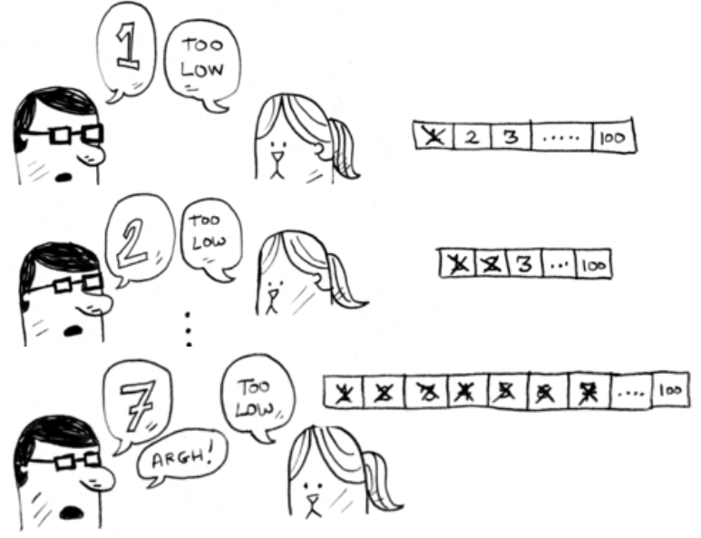
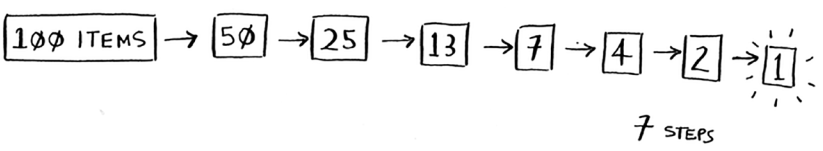

# Simple or Linear Search

Linear search is a very basic and simple search algorithm. In Linear search, we search an element or value in a given array by traversing the array from the starting, till the desired element or value is found.

It compares the element to be searched with all the elements present in the array and when the element is matched successfully, it returns the index of the element in the array, else it return -1.

Linear Search is applied on unsorted or unordered lists, when there are fewer elements in a list. It has a time complexity of O(n)

Example: I’m thinking of a number between 1 and 100. You have to try to guess my number in the fewest tries possible. With every guess, I’ll tell you if your guess is too low, too high, or correct.

Suppose you start guessing like this: 1, 2, 3, 4 …. Here’s how it would go:

    

This is Linear search. With each guess, you’re eliminating only one number. If my number was 99, it could take you 99 guesses to get there!

# Binary Search

Binary search is an algorithm; <b>its input is a sorted list of elements.</b>

If an element you’re looking for is in that list, binary search returns the position where it’s located. Otherwise, binary search returns null.

Example: with above example: start guess with 50:

* Too low, but you just eliminated half the numbers! Now you know that 1–50 are all too low. Next guess: 75.
* Too high, but again you cut down half the remaining numbers! <b><i>With binary search, you guess the middle number and eliminate half the remaining numbers every time</b></i>. Next is 63 (halfway between 50 and 75).

    

This is binary search. Whatever number I’m thinking of, you can guess in a maximum of seven guesses—because you eliminate so many numbers with every guess!

    

